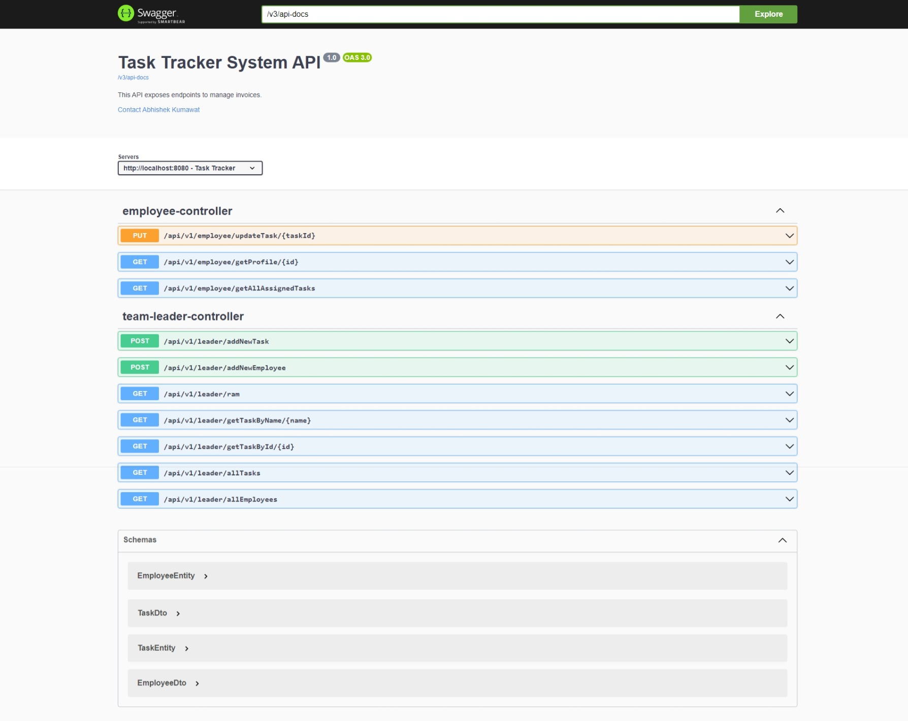

# Task-Tracker
Task Tracker is a comprehensive task management system designed to streamline the assignment, tracking, and completion of tasks within an organization. Built on the Spring Boot framework, Task Tracker provides a robust backend solution for managing tasks assigned to employees.\
\
With Task Tracker, team leaders can efficiently create, update, and assign tasks to individual team members. Employees can easily view their assigned tasks, update their status, and provide comments or feedback as needed. The application offers a user-friendly interface and a set of RESTful API endpoints for seamless integration with other systems.

## Technologies Utilized : ## 
- Java
- Spring Boot
- Spring Dev Tools
- Maven
- Hibernate
- Swagger
- H2 Database (for initial setup)
- MySQL (for development)
- Model Mapper
- Project Lombok
- Spring Tool Suite IDE

## Modules and Operations

### Team Leader

- **Create & Assign Task**: Endpoint to create a new task and assign to a employee.
- **Update Task**: Endpoint to update an existing task.
- **Get All Tasks**: Endpoint to retrieve a list of all tasks.
- **Get All Employees**: Endpoint to retrieve a list of all employees.
- **Get Task by ID**: Endpoint to retrieve details of a specific task by ID.
- **Get Employee by ID**: Endpoint to retrieve details of a specific Employee by ID.
- **Delete Task**: Endpoint to delete a task by ID.

### Employee Management

- **Get Profile Details**: Endpoint to retrieve the profile details of a specific employee.
- **Get Employee Tasks**: Endpoint to retrieve tasks assigned to a specific employee.
- **Update Task**: Endpoint to update an existing task after work done.
\
\
\
## Swagger UI

